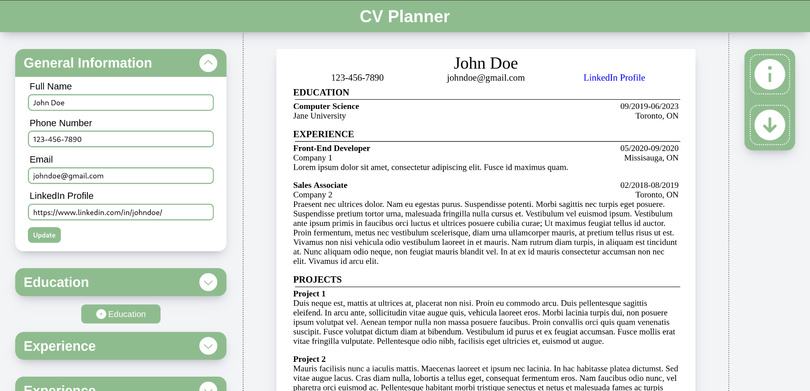

# Tempest : OdinProject CV Maker

**Note:** The website is not mobile responsive.

This website was made for the OdinProject's CV Maker(CV Application) assignment. The assignment's purpose was to learn how to utilize React. The main takeaway was how components are created and implemented as well as how useEffect works.

## Live Demo:
[CV Planner](https://naetsawd-cvplanner.netlify.app/)

## About Website:
CV Planner is a website where you can go to plan your CV and get an idea of how to set it up in one page with a format that is very popular. Users are able to add multiple education, experience and project items according to their liking. In the end, users can download their prototype if they like.

## Made Using:
- JavaScript
- HTML5
- CSS3
- Node.js
- Vite to create React template
- React.js
